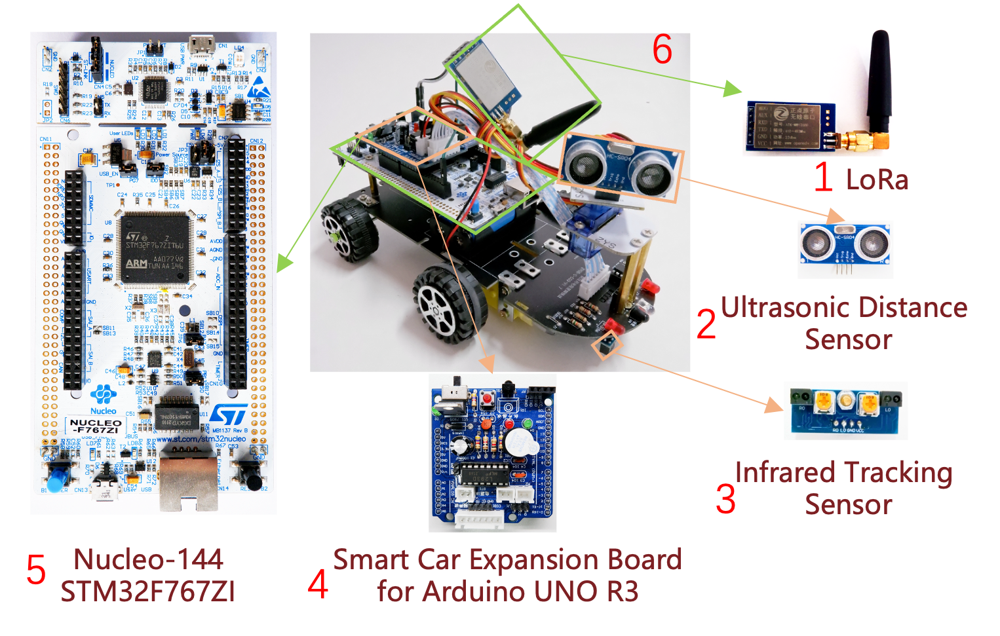
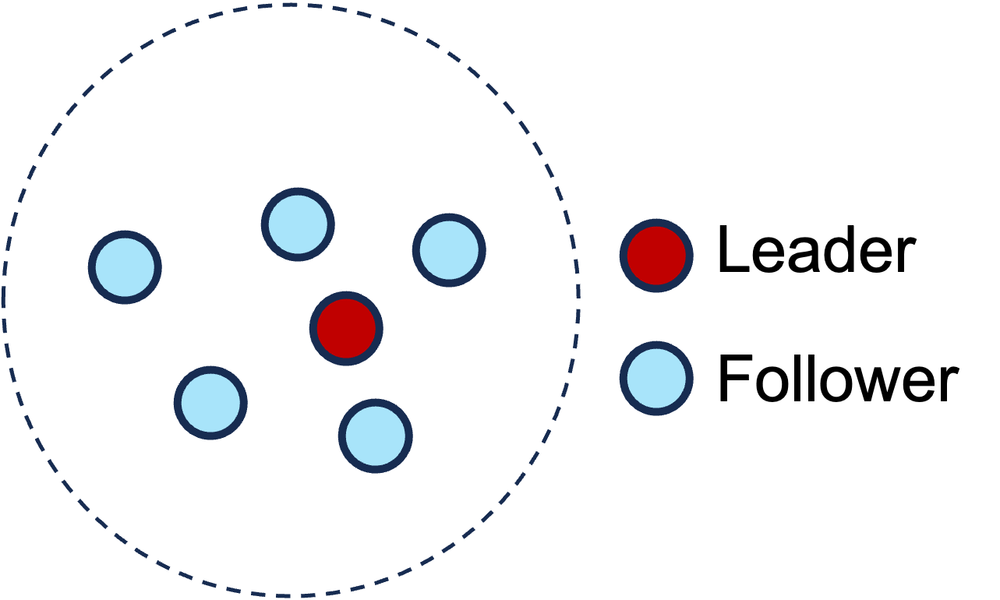
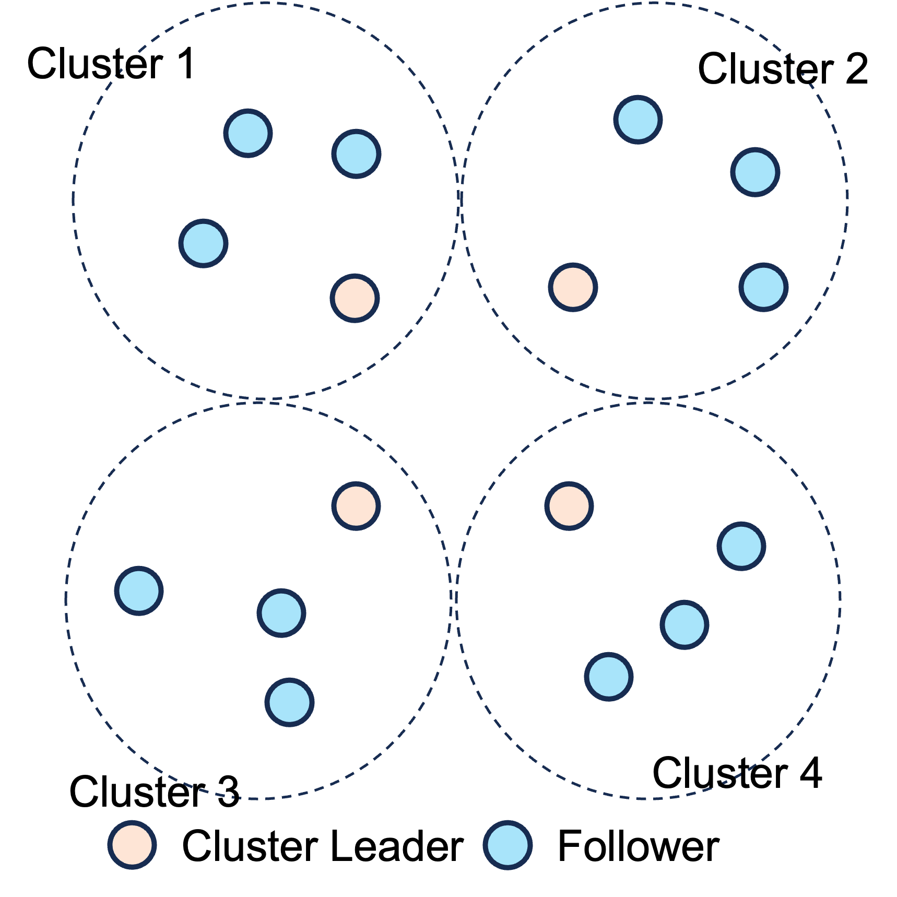

# WirelessConsensus

This repository is for "Partially Synchronous BFT Consensus Made Practical in Wireless Networks."

### Note

We provide three consensus algorithms: PBFT, Tendermint (Tendermint1 and Tendermint2), and HotStuff. There are five communication protocols available: ReduceCatch, CSMA-ACK, CSMA-NACK, TDMA-ACK, and TDMA-NACK. The folders "Single-Hop" and "Multi-Hop" respectively contain code for single-hop and multi-hop networks.

The "Single-Hop" folder contains 20 subfolders, each representing a specific consensus protocol and communication protocol combination. Each subfolder serves as a Keil project directory and follows the naming convention "\<Consensus Protocol>_\<Communication Protocol>" (e.g., PBFT_ReduceCatch).

The "Multi-Hop" folder contains 20 subfolders, each representing a specific consensus protocol and communication protocol combination. Each subfolder serves as a Keil project directory and follows the naming convention "\<Consensus Protocol>_\<Communication Protocol>_Multi-Hop" (e.g. PBFT_ReduceCatch_Multi-Hop).

Each Keil project directory contains 10 folders: "APPLICATION", "CMSIS", "CORE", "CRYPTO", "FreeRTOS", "HALLIB", "HARDWARE", "LORA", "SYSTEM", and "USER".

"APPLICATION" folder contains the main consensus process code files.

"LORA" folder contains LoRa communication code files.

"CRYPTO" folder contains cryptographic tools code files.

The remaining seven folders store FreeRTOS system files, HAL library functions, etc.

### Prerequisites

We provide a Keil project for each consensus algorithm.

Keil version: [5.36](https://developer.arm.com/Tools%20and%20Software/Keil%20MDK)

Operating System: [FreeRTOS]([FreeRTOS - Market leading RTOS (Real Time Operating System) for embedded systems with Internet of Things extensions](https://www.freertos.org/index.html))

#### Hardware requirement

##### Smart Car



1. **LoRa:** This is the main communication device, with a communication range of up to 6 kilometers with a 3dBi gain antenna.

2. **Ultrasonic Distance Sensor(optional):** A sensor that measures the distance between the car and obstacles. 

3. **Infrared Tracking Sensor(optional):** Infrared tracking sensors are used to follow lines or edges.

4. **Smart Car Expansion Board for Arduino UNO R3:** The smart car expansion board is used to connect the sensors and other components of the car to the development board.

5. **Nucleo-144 STM32F767ZI:** The Nucleo-144 STM32F767ZI is a powerful development board that is well-suited for running consensus algorithms. Pin connections for other types of development boards need to be connected according to the development board pin diagram. 

6. **Smart Car:** The effect picture after the smart car is assembled.

2 and 3 are shown as two basic sensors, and other requirements need to be changed according to the application scenario.

##### Only Consensus Test

If you are only testing the consensus algorithm, you only need LoRa and the development board. Pin connection relationship between LoRa and the development board (we use serial port 3 to connect to LoRa)

The specific pin connection relationship between LoRa and the development board will depend on the specific development board you are using.

| LoRa                       | MD0     | AUX      | RXD      | TXD      | GND     | VCC    |
|:--------------------------:|:-------:|:--------:|:--------:|:--------:|:-------:|:------:|
| **Nucleo-144 STM32F767ZI** | **PG0** | **PE15** | **PB10** | **PB11** | **GND** | **5V** |

Note: Pins PB10 and PB11 should be set to AF7 alternate function.

### Run

The objective of ReduceCatch is to improve the communication efficiency of partially synchronous BFT consensus addressing aspects from both the bottom MAC layer and upper communication patterns. In order to fully test ReduceCatch, we provide a variety of network deployment methods: single-hop, multi-hop, static network, and dynamic network.

#### Note

- The `New_Proposal()` function is used to generate a new proposal. This function takes a command size as input, which determines the size of the proposal data.

- The `Commands_Size` variable determines the number of proposals that are included in each block. This variable is set by the leader.

We set the length of each proposal to 256 bits. Each proposal is generated using a random number generator: `RNG_Get_RandomNum();`. If you want to modify the length of each proposal, you can do so by modifying the variable `u8 output[32];` in the `void New_Proposal(u8 command_size);` function.

In TDMA, the length of a time slot is set using the variable `u16 slot = 400;`, with the unit being milliseconds.

For CSMA, the timer is controlled by General Timer 5, which is TIM5. TIM5 is configured using `btim_tim5_int_init(9000-1,10800-1);`, triggering an interrupt every 900 milliseconds. As described in the below code snippet, every five timer interrupts, which is equivalent to 4.5 seconds, represents one CSMA timer timeout.

```c
void HAL_TIM_PeriodElapsedCallback(TIM_HandleTypeDef *htim){
    //...
    if (htim == (&tim5_handler))
    {
		TIM5_Exceed_Times = TIM5_Exceed_Times + 1;
		if(TIM5_Exceed_Times >= 5){
			TIM5_Exceed_Times = 0;
		}
    }
    //...
}

```

In ReduceCatch, the variable `u8 NTX = 3;` sets the number of times a message is repeatedly sent during the Reduce phase.

The variable `u8 NTX_proposal = 1;` sets the number of times a leader sends a block proposal.

Note: In a dynamic network, each node also repeats sending the same message NTX times during the Catch phase.

#### Single-Hop

The communication distance between any two nodes should not exceed a single hop, as depicted in the diagram below.



In a single-hop architecture, all nodes share the same channel. To reduce congestion in the future, we will consider implementing multiple channels.

Channel switching and other LoRa parameters are configured using the `LoRa_Set();` function.

Here are some system parameters that need modification:

```c
id: Node ID. 
N: Total number of nodes.
f: Total number of Byzantine nodes.
Note: N>=3f+1
```

Note: Node with ID 1 is the leader.

#### Multi-Hop

As shown in the diagram for a multi-hop network deployment, all cluster leaders must be able to communicate within a single-hop distance. In future work, we will integrate a routing protocol. Apart from leader nodes, followers from different clusters should not communicate within a single-hop distance.



Due to the extensive communication range of LoRa, building a multi-hop network can be challenging, especially when attempting to create a static network. For the sake of convenience in testing, we provide an alternative method to build a multi-hop network by channel switching. In this approach, different clusters use different channels to avoid interference between them. After local consensus is achieved within each cluster, all leaders switch to the same channel to perform global consensus.

Here are some system parameters that need modification:

```c
id: Node ID. 
N: Total number of nodes in each cluster.
f: Total number of Byzantine nodes in each cluster.
Note: N>=3f+1
```

Note: Nodes with IDs 1, 5, 9, 13 are leaders, corresponding to cluster1, cluster2, cluster3, cluster4 respectively.

#### Dynamic Network

One method of deploying a dynamic network is to increase the distance between nodes to enhance environmental interference. Although this deployment approach more closely mirrors real-world conditions, the level of dynamism can vary at different times, making it challenging to test different consensus algorithms under consistent conditions.

To address this, we adjust the packet loss rate in the code to achieve a consistent level of dynamism. After LoRa receives packets and triggers an interrupt on the AUX pin, we set the packet loss rate. As shown in the code snippet below, for each received packet, a random number between 2 and 101 is generated. Packets with random numbers less than `DONE_THRES` are discarded. For example, with `DONE_THRES=11;`, the packet loss rate is 10%.

```c
void AUX_INT_IRQHandler(void){
    if(RNG_Get_RandomRange(2,101) <= DONE_THRES){
	    USART3_RX_STA = 0;
	    Lora_Int_Sta = LORA_INT_REDGE; 
	    Aux_Int(Lora_Int_Sta);
	    __HAL_GPIO_EXTI_CLEAR_IT(AUX_GPIO_PIN);
	    taskEXIT_CRITICAL();					
	    usart3_rx(1);
	    return;
    }
}
```

#### Static Network

- In a static network where the packet loss rate is 0, you will need to comment out the packet loss handling inside the `void AUX_INT_IRQHandler(void);` function.

- During testing, pay special attention to keeping the distance between nodes relatively small to minimize environmental interference.